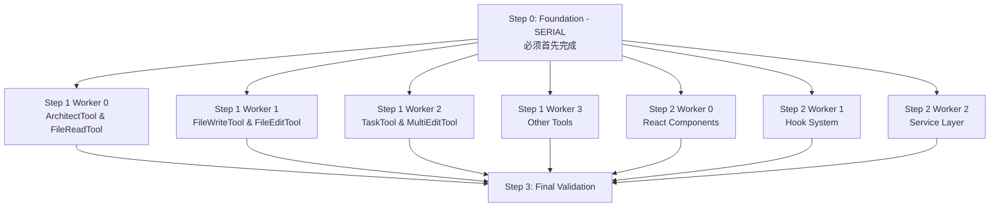

# TypeScript 错误修复执行计划

## 任务依赖关系图



## 执行顺序

### 🔴 Phase 0: 串行任务 (必须先完成)
**时间**: 1-2 小时
**文件**: `step_0_foundation_serial.md`

此任务建立所有其他修复的基础：
- 安装缺失依赖 (sharp)
- 创建类型增强文件
- 修复核心 Message 和 Tool 类型
- 修复 Key 类型扩展

**重要**: 在此任务完成前，不要开始任何其他任务！

### 🟢 Phase 1: 并行任务组 A (Step 1)
**时间**: 2-3 小时（并行执行）
**可同时分配给 4 个工作者**

| Worker | 文件 | 负责内容 | 预计时间 |
|--------|------|---------|----------|
| 0 | `step_1_parallel_worker_0.md` | ArchitectTool, FileReadTool | 60分钟 |
| 1 | `step_1_parallel_worker_1.md` | FileWriteTool, FileEditTool | 60分钟 |
| 2 | `step_1_parallel_worker_2.md` | TaskTool, MultiEditTool | 85分钟 |
| 3 | `step_1_parallel_worker_3.md` | StickerRequestTool, NotebookReadTool, AskExpertModelTool | 70分钟 |

### 🟢 Phase 2: 并行任务组 B (Step 2)
**时间**: 1-2 小时（并行执行）
**可同时分配给 3 个工作者**

| Worker | 文件 | 负责内容 | 预计时间 |
|--------|------|---------|----------|
| 0 | `step_2_parallel_worker_0.md` | React 19/Ink 6 组件修复 | 80分钟 |
| 1 | `step_2_parallel_worker_1.md` | Hook 系统修复 | 60分钟 |
| 2 | `step_2_parallel_worker_2.md` | Service 层和入口点修复 | 65分钟 |

### 🔵 Phase 3: 最终验证
**时间**: 30分钟
**所有并行任务完成后执行**

1. 运行完整的 TypeScript 检查
2. 测试所有主要功能
3. 记录剩余问题（如果有）

## 任务分配建议

### 如果有 1 个开发者
1. 按顺序执行：Step 0 → Step 1 (worker 0-3) → Step 2 (worker 0-2)
2. 总时间：约 6-8 小时

### 如果有 2 个开发者
1. 开发者 A：Step 0 → Step 1 Worker 0 & 1 → Step 2 Worker 0
2. 开发者 B：等待 Step 0 → Step 1 Worker 2 & 3 → Step 2 Worker 1 & 2
3. 总时间：约 4-5 小时

### 如果有 4+ 个开发者
1. 开发者 A：Step 0（独自完成）
2. 其他开发者：等待 Step 0 完成
3. Step 0 完成后：
   - 开发者 B-E：各自领取 Step 1 的一个 worker 任务
   - 开发者 A, F, G：各自领取 Step 2 的一个 worker 任务
4. 总时间：约 2-3 小时

## 进度跟踪

使用以下命令跟踪进度：

```bash
# 检查当前错误数量
npx tsc --noEmit 2>&1 | wc -l

# 检查特定步骤的错误
npx tsc --noEmit 2>&1 | grep "FileWriteTool"  # 示例

# 运行测试
bun run dev
```

## 预期结果

| 阶段 | 预期错误减少 | 剩余错误 |
|------|------------|----------|
| 初始状态 | - | 127 |
| Step 0 完成 | 40-50 | 77-87 |
| Step 1 完成 | 35-45 | 32-52 |
| Step 2 完成 | 25-35 | 7-27 |
| 最终清理 | 7-27 | 0 |

## 风险和缓解措施

### 风险 1: Step 0 未正确完成
**影响**: 所有后续任务都会遇到类型错误
**缓解**: 严格验证 Step 0 的完成标志

### 风险 2: 并行任务冲突
**影响**: 同时修改相同文件导致冲突
**缓解**: 每个 worker 负责独立的文件集

### 风险 3: 运行时错误
**影响**: 类型修复可能引入运行时问题
**缓解**: 每个阶段后进行功能测试

## 通信协议

### 任务开始
```
Worker X 开始 Step Y Worker Z
预计完成时间：HH:MM
```

### 遇到问题
```
Worker X 遇到阻塞问题：
- 问题描述
- 尝试的解决方案
- 需要的帮助
```

### 任务完成
```
Worker X 完成 Step Y Worker Z
- 修复错误数：N
- 剩余问题：[列表]
- 测试结果：[通过/失败]
```

## 质量检查清单

每个任务完成后检查：
- [ ] TypeScript 编译无错误（针对负责的文件）
- [ ] 功能测试通过
- [ ] 没有引入新的错误
- [ ] 代码格式正确
- [ ] 没有遗留的 TODO 或临时代码

## 最终交付标准

1. **零 TypeScript 错误**
2. **所有功能正常工作**
3. **没有运行时警告**
4. **代码可维护性未降低**
5. **性能无明显影响**

## 备注

- 每个 worker 文档都是自包含的，可以独立执行
- 如果某个任务比预期复杂，记录问题供后续优化
- 保持 git commits 小而频繁，便于回滚